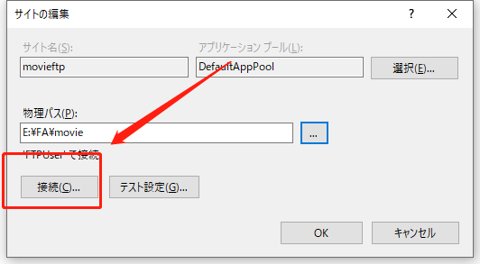

# FTP服务器搭建

## 启动IIS服务

1. 打开控制面板

​	win + R 打开命令栏 输入 control 打开控制面板

2. 打开程序和机能

3. 打开右上角的windows的机能有效化和无效化，然后打开IIS服务

   

   

   加载完成后可以在命令栏中输入services.msc查看IIS服务是否启动成功

   

## 创建FTP服务器

1.  在命令栏输入compmgmt.msc ，打开电脑管理

   

2.  打开服务器管理

   

3. 在连接处右击，选择创建FTP服务器

   

4. 输入服务器名字，选择服务器路径文件

   

FTP服务器创建完成

## 为服务器设置指定用户

1. 创建测试用户

   

   在用户列表中右击

   

   

   测试账户创建完成

2. 指定账户

   打开FTP认证

   

   将匿名认证状态设置为无效

   

   打开基本设定

   

   

   

   

   点击OK完成账户指定

