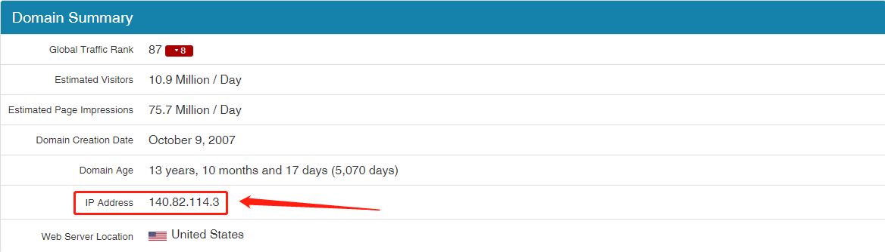

# 彻底解决GITHUB访问问题

​		由于最近使用公司电脑会经常遇到github访问不上，最后跳出来无法加载还有资源下载慢的问题，让人心态爆炸。相信很多小伙伴也和我一样。在经过诸多尝试后，终于解决了这个问题。现在就和大家分享以下解决的方法。

1. 确定GitHub官网IP（由于GitHub官网IP会不定期的更新，所以小伙伴们访问不上的时候可以登入下面这个网址进行查询GitHub的网址是否更新了）。

   [查询GitHub官网IP](https://github.com.ipaddress.com/)

   https://github.com.ipaddress.com/

   

2. 确认域名IP

   [查询域名IP](https://fastly.net.ipaddress.com/github.global.ssl.fastly.net)

   https://fastly.net.ipaddress.com/github.global.ssl.fastly.net

   

3. 确认静态资源IP

   [查询静态资源IP](https://github.com.ipaddress.com/assets-cdn.github.com)

   https://github.com.ipaddress.com/assets-cdn.github.com

   

4. 修改host文件

   Windows系统：打开C:\Windows\System32\drivers\etc\hosts

   *在底部加入前三步获得的内容，即：*

   ```tex
   #Git hosts
   140.82.114.3			    github.com
   199.232.69.194 github.global.ssl.fastly.net
   185.199.108.153 assets-cdn.github.com
   185.199.109.153 assets-cdn.github.com
   185.199.110.153 assets-cdn.github.com
   185.199.111.153 assets-cdn.github.com
   ```

   保存退出即可，需要提供管理员权限

   接着刷星DNS

   win + R 输入cmd 打开命令栏

   输入ipconfig/flushdns

   

   然后就ok搞定了，也可以试试看ping官网IP能不能PING的通

   

   完美！

   

   

   *参考链接：*

   https://zhuanlan.zhihu.com/p/158938544

   https://bbs.21ic.com/icview-3077274-1-1.html?_dsign=f9598e63


